# Cine-Claw v2 — System Architecture

## 1. Overview
Cine-Claw v2 is an extensible, self-hosted media platform designed for fast discovery, multi-tracker torrent aggregation, and seamless home theater playback.

```mermaid
graph TD
    Client["Browser / PWA / External Client"] -->|Port 3000: Web UI & Protected API| Gateway["Frontend Nginx Edge Proxy (Port 3000)"]
    
    subgraph Edge Security & Auth
        Gateway -->|"auth_request /api/auth/verify"| Auth["tracker-proxy /api/auth (Port 9118)"]
    end
    
    subgraph Core Discovery & Metadata
        IMDb["imdb-indexer (Port 8090 - Rust)"]
        Tantivy[("Tantivy Search Index")]
        TMDB["TMDB API (Seasons Resolver)"]
        PosterCache[("Poster Cache")]
        IMDb --> Tantivy
        IMDb --> TMDB
        IMDb --> PosterCache
    end

    subgraph Multi-Tracker Aggregation
        Proxy["tracker-proxy (Port 9118 - Go)"]
        FS["FlareSolverr (Port 8191)"]
        BBolt[("bbolt Cache (topic_hashes, imdb_cache)")]
        RuTracker["RuTracker.org"]
        RuTor["RuTor.info"]
        NNM["NNM-Club.to"]

        Proxy --> BBolt
        Proxy --> FS
        FS --> RuTracker
        Proxy --> RuTor
        Proxy --> NNM
    end

    subgraph Streaming & Playback
        Lodestarr["Lodestarr (Port 3420)"]
        Tiramisu["Tiramisu FUSE Engine (Ports 9080, 8092 - Go)"]
        VFS[("Virtual FUSE Mount (/media/virtual)")]
        Jellyfin["Jellyfin Media Server (Port 8096)"]
        
        Proxy -->|Register Torrent & File Stats| Tiramisu
        Proxy -->|Write MKV Stubs & NFO| VFS
        Tiramisu -->|FUSE Sequential Streaming| VFS
        VFS -->|Transparent Video Access| Jellyfin
        Proxy -->|Targeted Refresh /Items/{id}/Refresh| Jellyfin
        Proxy -.->|Magnet| Lodestarr
    end

    Gateway -->|Authorized /search, /poster| IMDb
    Gateway -->|Authorized /torrents, /series, /api/*| Proxy
    Client -->|Watch Stream / Browse Library| Jellyfin
    Client -->|Direct Magnet Click| Transmission["Local Torrent Client (e.g. Transmission)"]
```

---

## 2. End-to-End Request Lifecycle

### Step 1: Instant Title Search
1. User types in the search bar on the Frontend.
2. Request hits `GET http://localhost:8090/api/search?q=<query>&limit=10`.
3. `imdb-indexer` queries its embedded **Tantivy** full-text index and returns results in $<5$ms.
4. Poster images are proxied through `/api/poster/:tconst` with local disk caching to prevent external rate limits and CORS issues.

### Step 2: Series Seasons & Metadata Resolution
1. When a title is opened, if it is a TV series (`titleType == 'tvSeries' | 'tvMiniSeries'`), Frontend requests `GET http://localhost:8090/api/series/:tconst/seasons`.
2. `imdb-indexer` resolves the IMDb `tconst` against the TMDB API to fetch total seasons, episode counts, and air years.

### Step 3: Multi-Tracker Torrent Aggregation
1. Frontend requests `GET http://localhost:9118/api/torrents?tconst=<tconst>&title=<title>&ru_title=<ru_title>&year=<year>&type=<type>`.
2. `tracker-proxy` checks its local bbolt cache (`imdb_cache` bucket). If valid and not stale, it returns immediately.
3. On cache miss or `force_refresh=true`:
   - Scrapes **RuTracker** (routed via FlareSolverr to bypass Cloudflare Turnstile).
   - Scrapes **RuTor** (direct HTTP GET with query normalization).
   - Scrapes **NNM-Club** (rate-limited via semaphore $\le 2$, with Windows-1251 decoding).

### Step 4: Cross-Tracker Deduplication & Synthesis
1. The aggregator groups all returned candidate torrents by size with a tolerance of $\pm 0.105\text{ GB}$.
2. For candidate clusters containing items without an InfoHash, `tracker-proxy` fetches topic pages concurrently (using bbolt `topic_hashes` cache to avoid redundant network hits).
3. Exact InfoHash matches across RuTracker, RuTor, and NNM-Club are collapsed into a **single unified card**:
   - Seed counts are summed: $\sum \text{seeds} = \text{seeds}_{\text{RuTracker}} + \text{seeds}_{\text{RuTor}} + \text{seeds}_{\text{NNM}}$.
   - Trackers badges show all participating trackers.
   - Magnet link is dynamically rewritten into a multi-tracker magnet containing official announces for all participating trackers.

### Step 5: Client-Side Fast Filtering
1. The Frontend receives the merged torrent payload.
2. Torrent titles are parsed on the client for:
   - **Resolution**: `4k`, `1080p`, `lq` (720p, HDRip, etc.).
   - **Season ranges**: Supports single seasons (`Сезон 1`), ranges (`Сезоны 1-3`), and sets (`S01-S02`).
3. Switching season tabs or resolution buttons filters the list instantly in memory without re-fetching backend APIs.

### Step 6: One-Click Instant Streaming (Tiramisu FUSE + Jellyfin)
1. User clicks the **"Смотреть"** button on any torrent card in the Frontend.
2. Frontend dispatches `POST /api/stream/mount` with magnet URI (or tracker + torrent ID), title, IMDb `tconst`, media type, and season number.
3. `tracker-proxy` (`pkg/stream/mounter.go`):
   - Resolves missing InfoHash/magnet on the fly via tracker resolver.
   - Submits the multi-tracker magnet to Tiramisu's GoStorm API (`POST http://tiramisu:8090/torrents`).
   - Polls for torrent file stats until metadata/file-tree is ready.
   - Writes JSON `.mkv` stubs (~150 bytes each) into `/media/source/movies/` or `/media/source/shows/`. Each stub specifies `"url": "http://127.0.0.1:8090/stream?link=<hash>&index=<id>"`.
   - Queries `imdb-indexer` (`GET /series/:tconst/episodes`) to fetch full episode details (Russian title, plot, air dates).
    - Writes accompanying `.nfo` XML metadata files (`movie.nfo`, `tvshow.nfo`, and per-episode `<title> - SxxExx.nfo`) populated with titles and episode numbers for instant Jellyfin recognition without remote lookups.
    - Triggers targeted parent library refresh (`POST /Items/{folderId}/Refresh`) and recursive item refresh (`POST /Items/{itemId}/Refresh`), completely bypassing the 60-second `LibraryMonitor` debounce.
4. Tiramisu FUSE exposes the virtual files at `/media/virtual` (mounted into Jellyfin at `/media`).
5. Jellyfin scans the newly mounted media. A smart `ffprobe` wrapper inside the Jellyfin container caches stream signatures per series/season, reducing 86-episode media probes from 20 minutes to under 3 seconds!
6. All seasons and episodes appear instantly with full metadata, ready for immediate playback.

---

## 3. Communication Protocols & Inter-Service Contracts

| Consumer | Provider | Protocol / Endpoint | Purpose |
| :--- | :--- | :--- | :--- |
| `frontend` | `imdb-indexer` | `GET /api/search?q=...` | Fast title search |
| `frontend` | `imdb-indexer` | `GET /api/series/:tconst/seasons` | TV seasons metadata |
| `frontend` | `imdb-indexer` | `GET /api/poster/:tconst` | Cached poster proxy |
| `frontend` | `tracker-proxy` | `GET /api/torrents?...` | Aggregated & deduped torrents |
| `frontend` | `tracker-proxy` | `POST /api/torrents/refresh` | Invalidate cache & re-fetch |
| `frontend` | `tracker-proxy` | `POST /api/stream/mount` | Mount torrent into Tiramisu & Jellyfin |
| `tracker-proxy` | `imdb-indexer` | `GET /series/:tconst/episodes` | Fetch episode titles & plots for NFO generation |
| `tracker-proxy` | `flaresolverr` | `POST /v1` | FlareSolverr Turnstile clearance |
| `tracker-proxy` | Trackers | HTTP GET / POST | Scrapes RuTracker, RuTor, NNM-Club |
| `tracker-proxy` | `tiramisu` | `POST /torrents` | Register torrent magnet with GoStorm |
| `tracker-proxy` | `jellyfin` | `POST /Items/{id}/Refresh` | Targeted library and item refresh |
| `jellyfin` | `tiramisu` | FUSE VFS (`/media/virtual`) | Sequential piece reading for video streaming |
| `jellyfin` | `tiramisu` | `POST /plex/webhook` | PlaybackStart/Stop webhook triggering Priority Mode & fast start chunks |

---

## 4. Extension Architecture
The platform is designed to decouple **Metadata Discovery** (`imdb-indexer`), **Tracker Aggregation** (`tracker-proxy`), and **Media Delivery** (`tiramisu` & `jellyfin`):
- New indexers or metadata providers can be added without modifying the torrent scrapers.
- New torrent trackers (e.g. Kinozal, зарубежные трекеры) are implemented as isolated scrapers in `tracker-proxy/pkg/trackers/`.
- Download/streaming targets receive standard synthesized BitTorrent magnets and torrent files, allowing easy swap of download engines.

---

## 5. Linux & NAS Deployment Architecture (Universal Installer)

Cine-Claw v2 includes a turnkey interactive deployment script (`install.sh`) designed to run the entire 7-service microservice topology inside Docker on Network Attached Storage (NAS) environments (Synology DSM 7+, TrueNAS SCALE, unRAID, QNAP) and headless Linux servers.

```mermaid
graph TD
    User["User / Admin"] -->|./install.sh| Installer["install.sh (Universal Installer)"]
    
    subgraph Preflight Diagnostics
        Installer --> P1["Check Linux / Synology DSM environment"]
        Installer --> P2["Check Docker daemon & Compose v1/v2"]
        Installer --> P3["Probe /dev/fuse (auto-insmod fuse.ko / modprobe)"]
        Installer --> P4["Auto-detect Primary LAN IP (ip route / route get)"]
    end

    subgraph Interactive Configuration
        Installer --> C1["TMDB API Key (validated, with existing-key preservation)"]
        Installer --> C2["Host IP / Domain (defaults to auto-detected LAN IP)"]
        Installer --> C3["Data Directory (default ./data or NAS share path)"]
        Installer --> C4["Optional Tracker Credentials (RuTracker, NNM-Club)"]
        Installer --> EnvFile[".env Configuration File"]
    end

    subgraph Storage Scaffolding
        Installer --> S1["Create directories: media/{source,library,virtual}, caches, indices"]
        Installer --> S2["Enforce chmod 777 on shared mount paths (avoid UID collisions)"]
        Installer --> S3["Provision default configs: tiramisu/config.json, tracker-proxy/config.yaml"]
    end

    subgraph Container Orchestration
        Installer --> Compose["docker compose up -d --build"]
        Compose --> Net["cineclaw-net (Docker Bridge)"]
        Net --> FE["frontend (Nginx :3000)"]
        Net --> Idx["imdb-indexer (:8090)"]
        Net --> Prx["tracker-proxy (:9118)"]
        Net --> Trm["tiramisu (:9080, :8092)"]
        Net --> Jlf["jellyfin (:8096)"]
        Net --> Flr["flaresolverr (:8191)"]
        Net --> Lds["lodestarr (:3420)"]
    end

    subgraph Post-Install Automation
        Installer --> Hook["scripts/setup-jellyfin-webhook.sh"]
        Hook --> Jlf
        Hook --> Trm
        Installer --> Banner["Summary Banner with Clickable Links & Commands"]
    end
```



### Production Docker Containers
- **`frontend` (`frontend/Dockerfile`)**: Multi-stage build (`node:22-alpine` builder $\to$ `nginx:alpine` runtime). Nginx serves the compiled React 19 PWA and reverse-proxies `/search`, `/poster`, `/status`, `/api`, `/series` to `http://imdb-indexer:8090` and `/torrents` to `http://tracker-proxy:9118`. PWA fallback is handled cleanly with `try_files $uri $uri/ /index.html`.
- **`imdb-indexer` (`imdb-indexer/Dockerfile`)**: Multi-stage build (`rust:1.85-bookworm` builder $\to$ `debian:bookworm-slim` minimal runtime). Mounts persistent data directory for Tantivy indices (`/data/indices`), downloads (`/data/downloads`), and posters (`/data/posters`). Reads `TMDB_API_KEY` from container environment.

### FUSE Mount & Shared Storage Model
- **Tiramisu** runs with `cap_add: SYS_ADMIN`, `devices: [/dev/fuse]`, and `security_opt: [apparmor:unconfined]`.
- **Shared Mount Propagation**:
  - Tiramisu mounts `/media/virtual` with `:rshared`.
  - Jellyfin mounts `/media/virtual` with `:rslave`.
  - Stubs written by `tracker-proxy` into `/media/source` instantly appear as real virtual `.mkv` files in Jellyfin without copying disk bytes.


