# Cine-Claw v2 — System Architecture

## 1. Overview
Cine-Claw v2 is an extensible, self-hosted media platform designed for fast discovery, multi-tracker torrent aggregation, and seamless home theater playback.

```mermaid
graph TD
    Client["Browser / Mobile PWA (React 19, Port 3000)"] -->|Port 3000: Web UI & Protected API| Gateway["Frontend Nginx Edge Proxy (Port 3000)"]
    TVClient["Android TV Client (Compose TV, Media3)"] -->|REST /api (Feeds, Search, Progress)| Gateway
    TVClient -->|Direct HTTP Range Streaming (:8092)| TorrServer
    TVClient -->|Progress Sync (:9118)| Proxy
    AppleTVClient["Apple TV Client (tvOS 18, SwiftUI, KSPlayer)"] -->|REST /api (Feeds, Search, Progress)| Gateway
    AppleTVClient -->|Direct MKV / HTTP Range (:8092)| TorrServer
    AppleTVClient -->|Progress Sync (:9118)| Proxy
    
    subgraph Edge Security & Auth
        Gateway -->|"auth_request /api/auth/verify"| Auth["tracker-proxy /api/auth (Port 9118)"]
    end
    
    subgraph Core Discovery & Metadata
        IMDb["imdb-indexer (Port 8090 - Rust)"]
        Tantivy[("Tantivy Search Index")]
        TMDB["TMDB API (Seasons Resolver)"]
        PosterCache[("Poster Cache")]
        IMDb --> Tantivy
        IMDb --> TMDB
        IMDb --> PosterCache
    end

    subgraph Multi-Tracker Aggregation
        Proxy["tracker-proxy (Port 9118 - Go)"]
        FS["FlareSolverr (Port 8191)"]
        BBolt[("bbolt Cache (topic_hashes, imdb_cache)")]
        RuTracker["RuTracker.org"]
        RuTor["RuTor.info"]
        NNM["NNM-Club.to"]

        Proxy --> BBolt
        Proxy --> FS
        FS --> RuTracker
        Proxy --> RuTor
        Proxy --> NNM
    end

    subgraph Streaming & Playback
        TorrServer["TorrServer MatriX (Port 8092 - Go)"]
        SQLite[("cineclaw.db (SQLite: watch_progress, favorites)")]
        Lodestarr["Lodestarr (Port 3420)"]
        
        Proxy -->|Add/Probe/Stream| TorrServer
        Proxy -->|Progress & Resume Tracking| SQLite
        TorrServer -->|GStreamer Remux HLS & WebVTT| Client
        TorrServer -.->|Direct Stream (vlc, iina, infuse)| Client
        Proxy -.->|Magnet| Lodestarr
    end

    subgraph AI & Critic Intelligence
        CineClawAI["cineclaw-ai (Port 9120 - Go)"]
        OMDb["OMDb API (RT, Metacritic, Awards)"]
        OpenRouter["OpenRouter (Gemini 2.5 Flash)"]
        AIBBolt[("bbolt Cache (critic_summaries)")]

        CineClawAI --> OMDb
        CineClawAI --> TMDB
        CineClawAI --> OpenRouter
        CineClawAI --> AIBBolt
    end

    Gateway -->|Authorized /search, /poster| IMDb
    Gateway -->|Authorized /torrents, /series, /api/*| Proxy
    Gateway -->|Authorized /api/ai/*| CineClawAI
    Client -->|Watch Stream / Browse Library| Jellyfin
    Client -->|Direct Magnet Click| Transmission["Local Torrent Client (e.g. Transmission)"]
```

---

## 2. End-to-End Request Lifecycle

### Step 1: Instant Title Search
1. User types in the search bar on the Frontend.
2. Request hits `GET http://localhost:8090/api/search?q=<query>&limit=10`.
3. `imdb-indexer` queries its embedded **Tantivy** full-text index, enriches hits with `poster_path` and `backdrop_path` from `redb` (`data/imdb-indexer/poster_paths.redb`) or TMDB with rate-limit pacing, and returns results in $<5$ms.
4. Clients stream artwork directly from TMDB's edge Cloudflare CDN (`https://image.tmdb.org/t/p/{size}{path}`) with responsive resolutions and zero server disk I/O.

### Step 2: Series Seasons & Metadata Resolution
1. When a title is opened, if it is a TV series (`titleType == 'tvSeries' | 'tvMiniSeries'`), Frontend requests `GET http://localhost:8090/api/series/:tconst/seasons`.
2. `imdb-indexer` resolves the IMDb `tconst` against the TMDB API to fetch total seasons, episode counts, and air years.

### Step 3: Multi-Tracker Torrent Aggregation
1. Frontend requests `GET http://localhost:9118/api/torrents?tconst=<tconst>&title=<title>&ru_title=<ru_title>&year=<year>&type=<type>`.
2. `tracker-proxy` checks its local bbolt cache (`imdb_cache` bucket). If valid and not stale, it returns immediately.
3. On cache miss or `force_refresh=true`:
   - Scrapes **RuTracker** (routed via FlareSolverr to bypass Cloudflare Turnstile).
   - Scrapes **RuTor** (direct HTTP GET with query normalization).
   - Scrapes **NNM-Club** (rate-limited via semaphore $\le 2$, with Windows-1251 decoding).

### Step 4: Cross-Tracker Deduplication & Synthesis
1. The aggregator groups all returned candidate torrents by size with a tolerance of $\pm 0.105\text{ GB}$.
2. For candidate clusters containing items without an InfoHash, `tracker-proxy` fetches topic pages concurrently (using bbolt `topic_hashes` cache to avoid redundant network hits).
3. Exact InfoHash matches across RuTracker, RuTor, and NNM-Club are collapsed into a **single unified card**:
   - Seed counts are summed: $\sum \text{seeds} = \text{seeds}_{\text{RuTracker}} + \text{seeds}_{\text{RuTor}} + \text{seeds}_{\text{NNM}}$.
   - Trackers badges show all participating trackers.
   - Magnet link is dynamically rewritten into a multi-tracker magnet containing official announces for all participating trackers.

### Step 5: Client-Side Fast Filtering
1. The Frontend receives the merged torrent payload.
2. Torrent titles are parsed on the client for:
   - **Resolution**: `4k`, `1080p`, `lq` (720p, HDRip, etc.).
   - **Season ranges**: Supports single seasons (`Сезон 1`), ranges (`Сезоны 1-3`), and sets (`S01-S02`).
3. Switching season tabs or resolution buttons filters the list instantly in memory without re-fetching backend APIs.

### Step 6: One-Click Instant Streaming (TorrServer MatriX + Pure-Go SQLite)
1. User clicks the **"Смотреть"** button on any torrent card or quality preset in the Frontend.
2. Frontend dispatches `POST /api/stream/mount` with magnet URI, title, IMDb `tconst`, media type, and season number.
3. `tracker-proxy` (`pkg/stream/service.go`):
   - Submits the multi-tracker magnet to TorrServer MatriX (`POST http://torrserver:8090/torrents`).
   - Awaits torrent metadata and matches target video file (movie or specific series episode via `ParseSeasonEpisode`).
   - Probes audio and subtitle streams via TorrServer file probe API.
   - Persists playback state and torrent bindings into pure-Go SQLite (`data/tracker-proxy/cineclaw.db`).
4. Embedded cinema player attaches HLS stream (`/torr/gst/<hash>/master.m3u8?index=<file-id>&audio=<idx>`) with zero-transcode GStreamer remuxing for video and AAC audio conversion.
5. Watch progress, resume timestamps, and completion state synchronize continuously to SQLite (`/api/playback/progress`), powering the top «Продолжить просмотр» home shelf and Next Up series episode recommendations.
6. Users can also launch external players (VLC, IINA, Infuse) with untranscoded direct stream URLs.

### Step 7: AI Critics Consensus & Scores Aggregation
1. When opening a movie/series modal on Frontend, `useGetCriticSummaryQuery(tconst)` requests `GET /api/ai/critics/:tconst` through Nginx.
2. `cineclaw-ai` (`pkg/critics/engine.go`):
   - Checks local persistent bbolt database (`critic_summaries` bucket). On cache hit, returns JSON in 0ms.
   - On cache miss, concurrently queries:
     - **OMDb API**: Rotten Tomatoes Tomatometer %, Metascore (0-100), IMDb User Rating & Votes, and Awards statement.
     - **TMDB API**: Top 5 critical & audience reviews.
   - Synthesizes an executive consensus via OpenRouter LLM (`google/gemini-2.5-flash`):
     - Tone classification (`strongly_positive`, `positive`, `mixed`, `negative`).
     - Concise 2-sentence Russian verdict.
     - Bullet points of top strengths (pros) and weaknesses (cons).
     - Target audience recommendation («Кому понравится»).
   - Saves result into bbolt cache and returns payload to Frontend.
3. Frontend renders responsive obsidian badges for RT %, Metascore, IMDb, and awards, alongside the expandable AI Consensus card.

---

## 3. Communication Protocols & Inter-Service Contracts

| Consumer | Provider | Protocol / Endpoint | Purpose |
| :--- | :--- | :--- | :--- |
| `frontend` | `imdb-indexer` | `GET /api/search?q=...` | Fast title search |
| `frontend` | `imdb-indexer` | `GET /api/series/:tconst/seasons` | TV seasons metadata |
| `frontend` | `imdb-indexer` | `GET /api/poster/:tconst` | Cached poster proxy |
| `frontend` | `tracker-proxy` | `GET /api/torrents?...` | Aggregated & deduped torrents |
| `frontend` | `tracker-proxy` | `POST /api/torrents/refresh` | Invalidate cache & re-fetch |
| `frontend` | `tracker-proxy` | `POST /api/stream/mount` | Mount torrent into TorrServer & retrieve stream URL |
| `frontend` | `tracker-proxy` | `POST /api/playback/progress` | Sync watch progress (`position_seconds`, duration) |
| `frontend` | `torrserver` | `GET /torr/stream/*` | Direct zero-transcode HTTP Range streaming |
| `frontend` | `torrserver` | `GET /torr/gst/*` | GStreamer HLS remuxing with audio track switching |
| `frontend` | `cineclaw-ai` | `GET /api/ai/critics/:tconst` | Rotten Tomatoes %, Metascore, awards & AI consensus |
| `cineclaw-ai` | OMDb | `GET /?i=:tconst&apikey=...` | Critic scores, ratings, and awards |
| `cineclaw-ai` | TMDB | `GET /3/find/:tconst` & `/3/:type/:id/reviews` | Reviews context for LLM |
| `cineclaw-ai` | OpenRouter | `POST /api/v1/chat/completions` | Structured AI critique synthesis (Gemini 2.5 Flash) |
| `tracker-proxy` | `imdb-indexer` | `GET /series/:tconst/episodes` | Fetch episode titles & plots for NFO generation |
| `tracker-proxy` | `flaresolverr` | `POST /v1` | FlareSolverr Turnstile clearance |
| `tracker-proxy` | Trackers | HTTP GET / POST | Scrapes RuTracker, RuTor, NNM-Club |
| `tracker-proxy` | `torrserver` | `POST /torrents` | Add/preload BitTorrent torrents |
| `tracker-proxy` | `torrserver` | `GET /gst/:hash/probe` | GStreamer rapid audio/subtitle tracks probing |

---

## 4. Extension Architecture
The platform is designed to decouple **Metadata Discovery** (`imdb-indexer`), **Tracker Aggregation** (`tracker-proxy`), and **Media Delivery** (`tiramisu` & `jellyfin`):
- New indexers or metadata providers can be added without modifying the torrent scrapers.
- New torrent trackers (e.g. Kinozal, зарубежные трекеры) are implemented as isolated scrapers in `tracker-proxy/pkg/trackers/`.
- Download/streaming targets receive standard synthesized BitTorrent magnets and torrent files, allowing easy swap of download engines.

---

## 5. Linux & NAS Deployment Architecture (Universal Installer)

Cine-Claw v2 includes a turnkey interactive deployment script (`install.sh`) designed to run the entire 7-service microservice topology inside Docker on Network Attached Storage (NAS) environments (Synology DSM 7+, TrueNAS SCALE, unRAID, QNAP) and headless Linux servers.

```mermaid
graph TD
    User["User / Admin"] -->|./install.sh| Installer["install.sh (Universal Installer)"]
    
    subgraph Preflight Diagnostics
        Installer --> P1["Check Linux / Synology DSM environment"]
        Installer --> P2["Check Docker daemon & Compose v1/v2"]
        Installer --> P3["Probe /dev/fuse (auto-insmod fuse.ko / modprobe)"]
        Installer --> P4["Auto-detect Primary LAN IP (ip route / route get)"]
    end

    subgraph Interactive Configuration
        Installer --> C1["TMDB API Key (validated, with existing-key preservation)"]
        Installer --> C2["Host IP / Domain (defaults to auto-detected LAN IP)"]
        Installer --> C3["Data Directory (default ./data or NAS share path)"]
        Installer --> C4["Optional Tracker Credentials (RuTracker, NNM-Club)"]
        Installer --> EnvFile[".env Configuration File"]
    end

    subgraph Storage Scaffolding
        Installer --> S1["Create directories: media/{source,library,virtual}, caches, indices"]
        Installer --> S2["Enforce chmod 777 on shared mount paths (avoid UID collisions)"]
        Installer --> S3["Provision default configs: tiramisu/config.json, tracker-proxy/config.yaml"]
    end

    subgraph Container Orchestration
        Installer --> Compose["docker compose up -d --build"]
        Compose --> Net["cineclaw-net (Docker Bridge)"]
        Net --> FE["frontend (Nginx :3000)"]
        Net --> Idx["imdb-indexer (:8090)"]
        Net --> Prx["tracker-proxy (:9118)"]
        Net --> AI["cineclaw-ai (:9120)"]
        Net --> Trm["tiramisu (:9080, :8092)"]
        Net --> Jlf["jellyfin (:8096)"]
        Net --> Flr["flaresolverr (:8191)"]
        Net --> Lds["lodestarr (:3420)"]
    end

    subgraph Post-Install Automation
        Installer --> Hook["scripts/setup-jellyfin-webhook.sh"]
        Hook --> Jlf
        Hook --> Trm
        Installer --> Banner["Summary Banner with Clickable Links & Commands"]
    end
```



### Production Docker Containers
- **`frontend` (`frontend/Dockerfile`)**: Multi-stage build (`node:22-alpine` builder $\to$ `nginx:alpine` runtime). Nginx serves the compiled React 19 PWA and reverse-proxies `/search`, `/poster`, `/status`, `/api`, `/series` to `http://imdb-indexer:8090`, `/torrents` to `http://tracker-proxy:9118`, and `/api/ai` to `http://cineclaw-ai:9120`. PWA fallback is handled cleanly with `try_files $uri $uri/ /index.html`.
- **`imdb-indexer` (`imdb-indexer/Dockerfile`)**: Multi-stage build (`rust:1.85-bookworm` builder $\to$ `debian:bookworm-slim` minimal runtime). Mounts persistent data directory for Tantivy indices (`/data/indices`), downloads (`/data/downloads`), and posters (`/data/posters`). Reads `TMDB_API_KEY` from container environment.
- **`cineclaw-ai` (`cineclaw-ai/Dockerfile`)**: Multi-stage build (`golang:alpine` builder $\to$ `alpine:latest` minimal runtime). Fast and low-memory (~15-25MB RSS). Connects to OMDb, TMDB, and OpenRouter, stores responses in persistent embedded bbolt database (`/data/cineclaw-ai/ai_store.db`).

### FUSE Mount & Shared Storage Model
- **Tiramisu** runs with `cap_add: SYS_ADMIN`, `devices: [/dev/fuse]`, and `security_opt: [apparmor:unconfined]`.
- **Shared Mount Propagation**:
  - Tiramisu mounts `/media/virtual` with `:rshared`.
  - Jellyfin mounts `/media/virtual` with `:rslave`.
  - Stubs written by `tracker-proxy` into `/media/source` instantly appear as real virtual `.mkv` files in Jellyfin without copying disk bytes.


