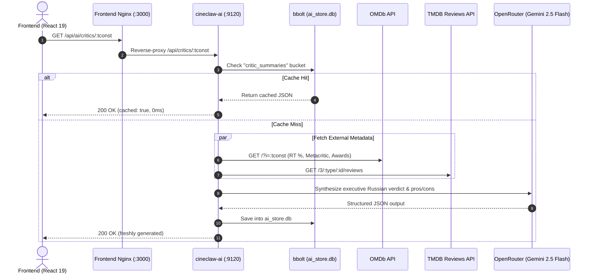

# CineClaw AI Microservice (`cineclaw-ai`)

## 1. Overview
`cineclaw-ai` is a lightweight, high-performance Go microservice (port `9120`) designed to aggregate professional and audience critic scores and synthesize concise, executive AI consensus reviews for movies and TV series. It also serves as the foundational core for future cinema consultant and recommendation agents.

Key characteristics:
- **Low footprint**: ~15–25 MB RSS memory on NAS / Docker runtime.
- **Embedded Persistence**: Zero-dependency embedded `bbolt` database (`data/cineclaw-ai/ai_store.db`).
- **Parallel Fetching**: Simultaneously queries OMDb (critic badges) and TMDB (user/critic reviews) with IPv4 routing.
- **Structured LLM Consensus**: Uses OpenRouter with Google's fast multimodal `google/gemini-2.5-flash` model with JSON schema enforcement.
- **Instant Caching**: Once synthesized, repeated queries return in <1ms with zero LLM API cost.

---

## 2. API Endpoints

### `GET /health` & `GET /api/health`
Healthcheck endpoint returning JSON status:
```json
{
  "status": "ok",
  "service": "cineclaw-ai",
  "version": "1.0.0"
}
```

### `GET /api/critics/:tconst`
Fetches critic ratings and AI consensus for a specific IMDb title ID (e.g., `tt15398776`).

#### Response Schema
```json
{
  "tconst": "tt15398776",
  "verdict": "Монументальный и напряженный байопик Кристофера Нолана о создании атомной бомбы...",
  "tone": "strongly_positive",
  "scores": {
    "rotten_tomatoes": 93,
    "metacritic": 90,
    "imdb": 8.2,
    "imdb_votes": "850,000",
    "awards": "Won 7 Oscars. 396 wins & 454 nominations total"
  },
  "pros": [
    "Блестящая актерская игра Киллиана Мёрфи и Роберта Дауни мл.",
    "Ошеломляющий саундтрек Людвига Горанссона и филигранный монтаж",
    "Глубокое исследование моральной ответственности и политических интриг"
  ],
  "cons": [
    "Плотный трехчасовой хронометраж и обилие диалогов требуют концентрации",
    "Нелинейная структура повествования может показаться перегруженной"
  ],
  "target_audience": "Любителям серьезных исторических и психологических драм...",
  "generated_at": "2026-09-09T12:00:00Z",
  "model": "google/gemini-2.5-flash",
  "cached": true
}
```

Tone values:
- `strongly_positive` (>= 85% RT / Metacritic)
- `positive` (70–84%)
- `mixed` (50–69%)
- `negative` (< 50%)

---

## 3. Architecture & Data Flow



---

## 4. Configuration (`.env`)

| Variable | Default | Description |
| :--- | :--- | :--- |
| `PORT_AI` / `PORT` | `9120` | HTTP listening port |
| `DATA_DIR` | `/data` | Path to persistent storage (`data/cineclaw-ai/`) |
| `OPENROUTER_API_KEY` | - | OpenRouter API Key for LLM completions |
| `OMDB_API_KEY` | - | OMDb API Key for Rotten Tomatoes & Metacritic |
| `TMDB_API_KEY` | - | TMDB API Key for user reviews and metadata |
| `AI_SUMMARY_MODEL` | `google/gemini-2.5-flash` | Model for critic synthesis |
| `AI_COMPACT_MODEL` | `google/gemini-2.5-flash-lite` | Ultra-fast lightweight model |
| `AI_AGENT_MODEL` | `google/gemini-2.5-flash` | Future conversational consultant model |

---

## 5. Storage Schema (`bbolt`)

Database file: `data/cineclaw-ai/ai_store.db`

Buckets:
- `critic_summaries`: Key: `tconst` (e.g. `tt15398776`), Value: JSON payload of `CriticSummaryResponse`.
- `chat_sessions`: Reserved for conversational agent history.
- `user_profiles`: Reserved for user cinema tastes and preferences.
