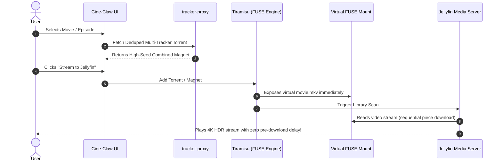

# Cine-Claw v2 — Roadmap & Future Services

## 1. Evolution Vision
Cine-Claw v2 is evolving from a torrent search and aggregation dashboard into a **complete self-hosted home cinema streaming ecosystem**.

Rather than manually downloading `.torrent` files or waiting for long downloads to finish, the target experience is **click-to-watch**: selecting a release in Cine-Claw instantly makes it playable in Jellyfin (or web/TV players) via transparent FUSE torrent mounting.

---

## 2. Milestone 1: Tiramisu FUSE Torrent Mounting (Completed ✅)

### Implemented Architecture
- Headless `tiramisu` container (`mrrobotogit/tiramisu:latest`) deployed with `/dev/fuse` and `SYS_ADMIN` capability.
- Internal GoStorm torrent engine on port `8090` (exposed on host as `8092`).
- Source stubs written to `./data/media/source` and mounted into Tiramisu's virtual FUSE directory (`./data/media/virtual`) using shared propagation (`:rshared`).
- `pkg/stream/mounter.go` in `tracker-proxy` registers magnet links, waits for file piece trees, and generates virtual `.mkv` JSON stubs with `http://127.0.0.1:8090/stream?link=<hash>&index=<id>`.
- Playback requests hit Tiramisu's VFS, triggering sequential chunk downloading from the deduplicated multi-tracker swarm with zero pre-download time.

---

## 3. Milestone 2: Jellyfin Media Server Integration (Completed ✅)

### Implemented Architecture
- Official `jellyfin/jellyfin:latest` deployed on port `8096`.
- Virtual directory `/data/media/virtual` mounted into Jellyfin at `/media:rslave` containing `movies/` and `shows/` libraries.
- **Rich NFO & Localized Media Assets**: `pkg/stream/mounter.go` writes companion `.nfo` files containing `<imdbid>`, `<tmdbid>`, Russian `<plot>`, `<rating>`, `<studio>`, `<premiered>`, and `<genre>` tags. Automatically downloads localized Russian season covers (`Season XX/poster.jpg`), episode thumbnail stills (`-thumb.jpg`), wide hero backdrops (`backdrop.jpg`), and transparent logos (`logo.png`).
- **Instant Targeted Indexing**: Instead of triggering slow whole-library scans or relying on the 60-second `LibraryMonitor` debounce, `tracker-proxy` triggers targeted folder and recursive item refresh via `POST /Items/{id}/Refresh?MetadataRefreshMode=FullRefresh&ImageRefreshMode=FullRefresh&ReplaceAllMetadata=true&ReplaceAllImages=true&Recursive=true`, registering newly mounted files in Jellyfin in $<1$ second.
- **Tiramisu Webhook Priority Mode Acceleration**: Jellyfin Webhook plugin sends `PlaybackStart`, `PlaybackProgress`, and `PlaybackStop` events to Tiramisu (`http://tiramisu:9080/plex/webhook`). Tiramisu dynamically activates `High Priority + Aggressive Mode` on the active swarm, aggressively fetching start chunks and stream head pieces for near-instant TTFF ($<0.1\text{s}$) with tail Cues freeze. Automated via repeatable script `./scripts/setup-jellyfin-webhook.sh`.
- **Frontend One-Click UX**: "Смотреть" button in `TorrentList.tsx` allows the user to mount any release with one click and opens the stream directly in Jellyfin.

---

## 4. Milestone 3: Intelligent Storage & Retention (Active 🚧)

- **Clean Media Deletion & Unmount (Completed ✅)**:
  - **Dual-Sync Deletion**: Solves POSIX symlink `unlink` limitation where Jellyfin deletion only dropped symlinks in `/media/library/`.
  - **Jellyfin `ItemDeleted` Webhook**: Jellyfin Webhook plugin sends `ItemDeleted` notifications to `tracker-proxy:9118/api/stream/webhook/deleted`, immediately removing the active swarm from GoStorm and purging the source JSON stub.
  - **Background Orphaned Stubs Reconciler**: Automatically detects and prunes orphaned source stubs and GoStorm torrents when library folders are deleted manually or via external apps.
  - **One-Click Unmount API & UI**: `POST /api/stream/unmount` endpoint and UI button with confirmation in Cine-Claw frontend modal.
- **Multi-Version / Multi-Source Video Support (Completed ✅)**:
  - **Native Movie Versions**: Files formatted as `<FolderName> - <VersionName>.mkv`. Jellyfin Core merges them natively into a single item with a version picker dropdown. Existing unversioned files are migrated seamlessly to `<FolderName> - Default.mkv`.
  - **Real-Time Series Episode Version Merging**: Episodes formatted as `<Show> - SXXEYY - <VersionName>.mkv`. `tracker-proxy` groups episodes by Season/Episode and executes `POST /Videos/MergeVersions?ids=primaryId,alternateId` in real-time, instantly attaching secondary MediaSources while retaining all rich Russian episode metadata, air dates, and thumbnails.
  - **Conflict Resolution Dialog**: UI prompts users with "Добавить как версию" or "Заменить" when adding an existing movie or season, with pre-populated quality labels (e.g. `4K UHD`, `1080p Remux`).
  - **Live Version & Season Status**: `GET /api/stream/status` reports `versions` and `seasons`, reflected directly in the frontend status banner.
- **Disk Space Governor**:
  - Monitor local storage consumption in `./data/media/` and `./data/tiramisu/root/cache/`.
  - When disk usage exceeds configured threshold (e.g. 85%), automatically purge least-recently-watched cached pieces from the Tiramisu cache while preserving user favorites.
- **Background Seeding Rules**:
  - Maintain healthy share ratios on semi-private trackers while managing local disk quotas.

---

## 5. Milestone 4: Subtitle Sync & Deep-Linking (Upcoming)

- **Subtitle Synchronization**:
  - Auto-extract or fetch external Russian / original English subtitles from OpenSubtitles / Subscene via IMDb ID and embed or place next to virtual media stubs.
- **Direct Playback Deep-Linking**:
  - Retrieve the created Jellyfin item ID from Jellyfin's API and redirect the frontend straight into Jellyfin's web player (`/web/index.html#!/details?id=<itemId>`) for seamless one-click play.
